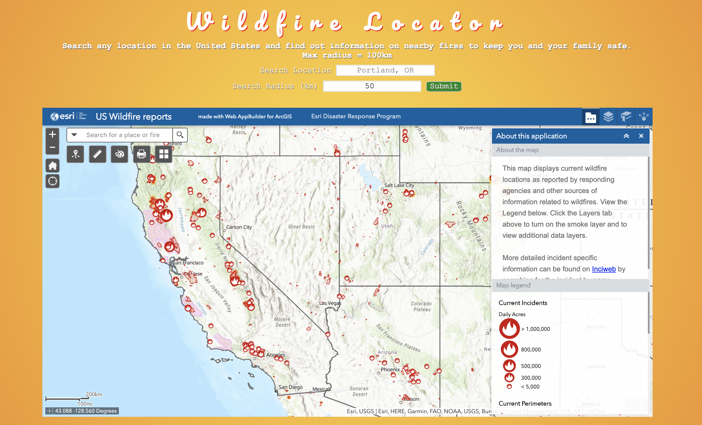
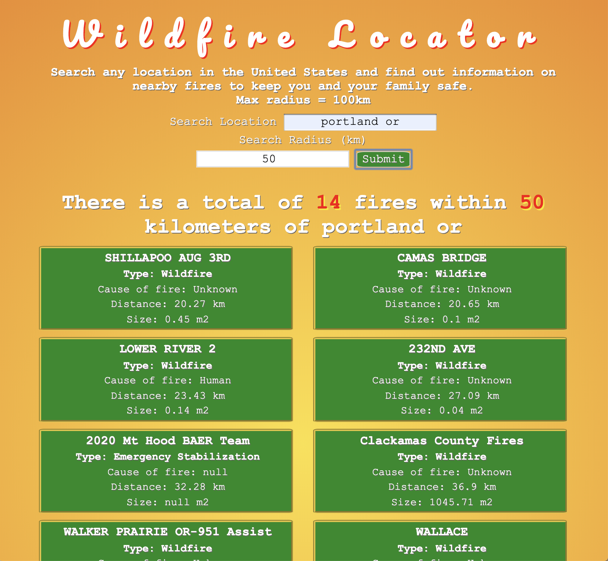

# FireSafety.io 
[site link](https://dan-j-gibson.github.io/Fire-Safety-Lookup/)

## Screenshots

Welcome page

Results Page

## Summary
- App takes two user inputs; location and radius from location and returns a list of fires with name, size, cause, containment and distance away for each fire in that radius. The welcome screen contains an imbedded map of the US showing active fires. Map is focused on the west coast where most fires are. Users can determine their or a specific location's fire safety level at the current time and track changes in real time.

## Built With

### Front-End
* HTML
* CSS

### Back-End
* JavaScript
* JQuery

### Testing
* Postman

### Author
* Dan Gibson - Front-end, back-end, styling

